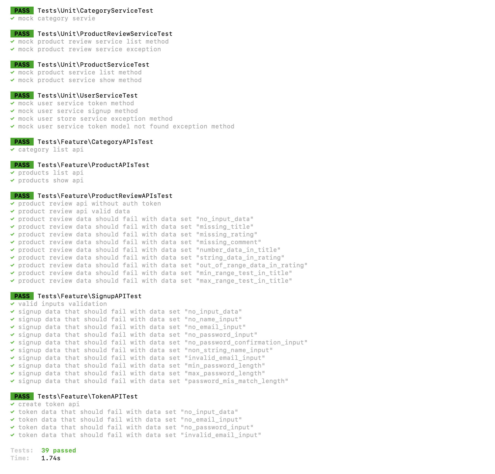
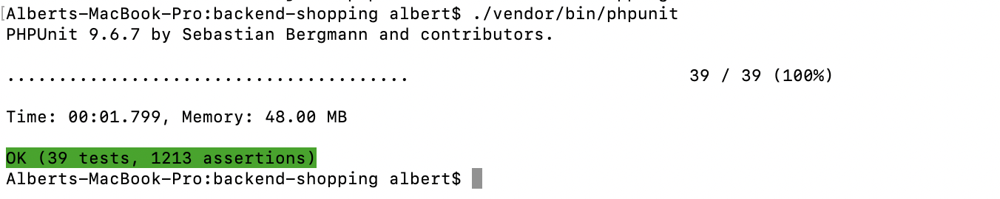

<p>
  <strong>The prerequisites to use Docker for local development:</strong><br>
  Docker Engine and Docker Compose installed on your system.
</p>
<p>
  <strong>Get the Laravel application from Git:</strong><br>
  Navigate to the folder where Docker has permission to open the files and run the following command to get the project:
</p>
<pre><code>
git clone https://github.com/albertrajmca/backend-shopping.git
cd backend-shopping
composer install
docker-compose up --build
php artisan migrate --seed (run incase of any error occured in the previous step)
php artisan test
</code></pre>
<p> Application will run on port 8000, we can access it by the URL "http://localhost:8000"</p>

```
screen shot of test case results
```


